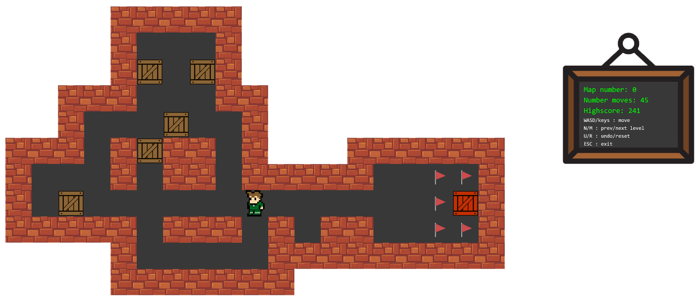
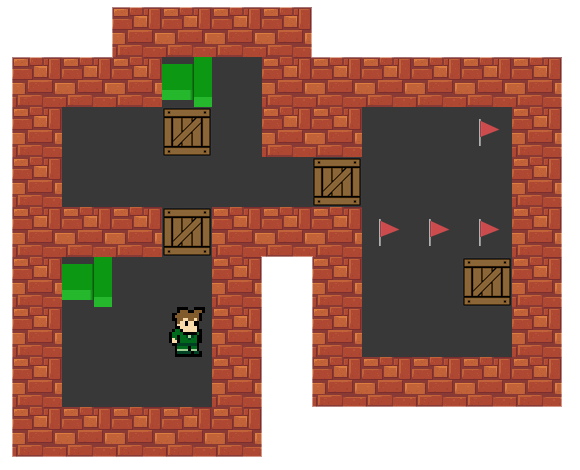
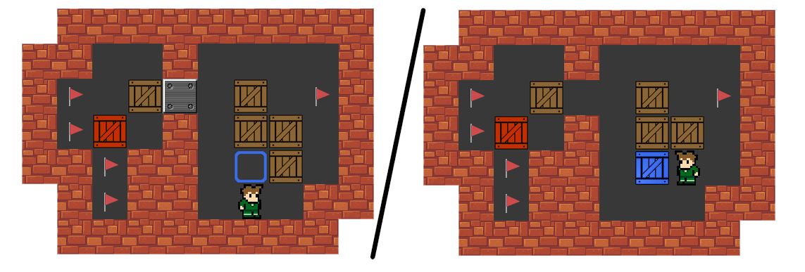
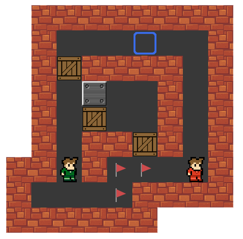
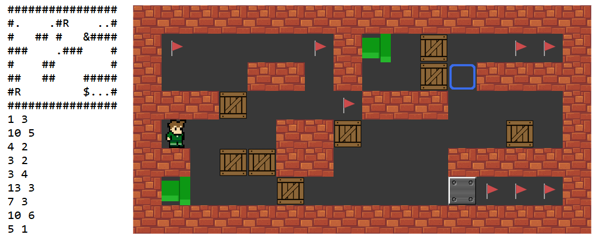

# sokoban-game

A [sokoban](https://en.wikipedia.org/wiki/Sokoban) game made in Java (8) with JavaFx.

### Features

- Pipes

- Gates/NegativeGates and pressure pads

- Co-op mode: a 2 player mode over TCP sockets

### Controls

- WASD/Keys : move
- N/M : prev/next level
- U/R : undo/restart
- Esc : exit

### Levels

Levels are represented in a .txt file, separated by 'MAPBREAK'. Each level has a structure (walls, flags, ...) followed by the coordinates of the player(s) and the coordinates of the boxes. The coordinates are counted with (0,0) being the first char starting from the bottom line. The map structure should be square or rectangular

    # -> wall
    . -> flag
      -> floor
    ! -> empty space
    U -> up pipe
    D -> down pipe
    L -> left pipe
    R -> right pipe
    $ -> gate
    % -> negative gate
    & -> pressure pad
    

There is a file for single mode (maps.txt) and another for multiplayer (maps-coop.txt).